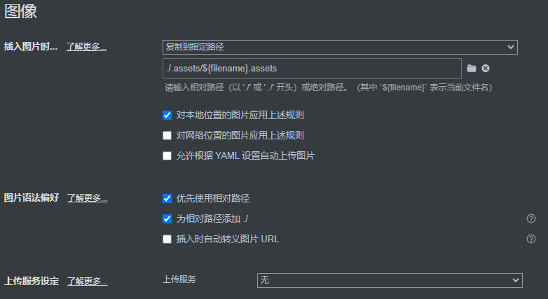

- 如果用jupyter自带的导出md功能无法显示正常显示图片

- 该脚本额能将ipynb文件中base64编码的图片提取出来, 放在`./.assets/文件名.assets/文件夹下`, 并将生成的md文件中对应图片路径一并修改为相对路径

# 使用步骤
## 1

- 首先创建以下结构的文件夹 (在哪创建的都行, 下面用的绝对路径)

    ```
    tmp
     |--ipynb
     |--md
    ```

- 将ipynb文件或包含ipynb文件的目录全复制到上面的`tmp/ipynb`文件夹中
---
## 2

- 安装依赖

  ```sh
  pip install -r requirements.txt
  ```

- 将代码`第1行`中的`base_dir`变量更改为上面`tmp`目录的绝对路径

- 执行

   ```sh
   python main.py
   ```
---
## 3
- 打开Typora ``偏好设置  -->  图像``

   将`插入图片时`改为`复制到指定路径`
   ```
   ./.assets/${filename}.assets
   ```

   


# 转换效果 (已测试)
- matplotlib, opencv的输出图片可以显示
- 直接粘贴的图片也可以显示
- pandans的输出表格在Typora显示异常, 在pycharm的md阅读格式下显示正常